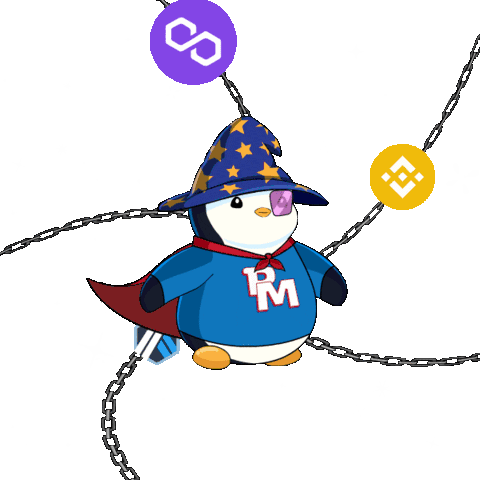
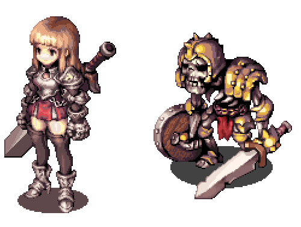
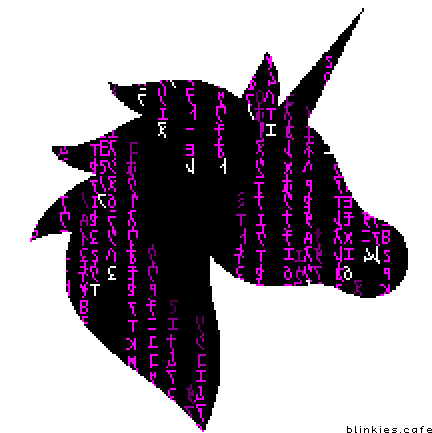

<div align="center">

<!-- LinkedIn-style Banner with Gradient Overlay -->


<br/>

</div>

#  About Me

<div align="center">

<table width="100%">
<tr>
<td width="35%" align="center" valign="top">

<!-- DEVELOPER IMAGE -->


<br/><br/>

<!-- NAME & TITLE -->
<h2>
   
  Sagar Singh
</h2>

<h3 style="margin-top: -10px;">Full Stack Developer</h3>
<h4 style="margin-top: -15px; color: #888;">Game Development Enthusiast</h4>

<br/>

<!-- LOCATION & STATUS -->
<p>
   
  <b>Based in India</b>
  <br/><br/>
   
  <b>Full Stack Developer</b>
</p>

<br/>

[](mailto:sagar.airee.coding@gmail.com)

</td>
<td width="65%" valign="top">

<br/>

## 👨‍💻 Introduction

Hello! I'm **Sagar Singh**, a passionate Full Stack Developer who loves building impactful solutions. I specialize in creating seamless web applications and exploring the exciting world of game development with cutting-edge technologies.

<br/>

## 💡 My Developer Profile

```javascript
const sagar = {
    role: "Full Stack Developer",
    currentProject: "Atheno-Card",
    interests: ["Web Development", "Game Development", "Emerging Tech"],
    philosophy: "Trends fade, but culture lasts forever",
    goals: "Building impactful solutions",
    exploring: ["Web3", "AI/ML", "Unreal Engine 5"],
    funFact: "Proud console.log() debugger"
};
```

<br/>

## 🎯 What I'm Exploring

<table>
<tr>
<td width="33%" align="center">
  
  <br/><br/>
  <b>Web3 & Blockchain</b>
  <br/>
  <sub>Learning decentralized technologies</sub>
</td>
<td width="33%" align="center">
  
  <br/><br/>
  <b>Artificial Intelligence</b>
  <br/>
  <sub>Exploring ML & neural networks</sub>
</td>
<td width="33%" align="center">
  
  <br/><br/>
  <b>Game Development</b>
  <br/>
  <sub>Creating experiences with UE5</sub>
</td>
</tr>
</table>

<br/>

</td>
</tr>
</table>

</div>

---

<div align="center">

##  Tech Stack

<!-- Gradient Header -->


</div>

<table align="center" width="100%">
<tr>
<td width="50%" valign="top">

###  Programming Languages

<p align="center">
  
</p>

<div align="center">


</div>

</td>
<td width="50%" valign="top">

###  Frontend Development

<p align="center">
  
</p>

<div align="center">


</div>

</td>
</tr>

<tr>
<td width="50%" valign="top">

###  Backend & Database

<p align="center">
  
</p>

<div align="center">


</div>

</td>
<td width="50%" valign="top">

###  Game Development & 3D

<p align="center">
  
  <br/><br/>
  
  
</p>

<div align="center">


</div>

</td>
</tr>

<tr>
<td width="50%" valign="top">

###  AI/ML & Data Science

<p align="center">
  
  <br/>
  
  
  
</p>

<div align="center">


</div>

</td>
<td width="50%" valign="top">

###  DevOps & Cloud

<p align="center">
  
</p>

<div align="center">


</div>

</td>
</tr>

<tr>
<td width="50%" valign="top">

###  Mobile Development

<p align="center">
  
</p>

<div align="center">


</div>

</td>
<td width="50%" valign="top">

###  Design & Tools

<p align="center">
  
</p>

<div align="center">


</div>

</td>
</tr>
</table>

---

<div align="center">

##  GitHub Analytics & Deep Metrics

<!-- Gradient Section Header -->


</div>

<br/>

<!-- Main Stats Cards with Shadow Effect -->
<table align="center" width="100%">
<tr>
<td width="50%" align="center">


</td>
<td width="50%" align="center">


</td>
</tr>
</table>

<br/>

<!-- Streak Stats with Gradient -->
<div align="center">

</div>

<br/>

<!-- Detailed Metrics Dashboard -->
<div align="center">

### 📊 Detailed GitHub Metrics


</div>

<br/>

<!-- Advanced Analytics Grid -->
<table align="center" width="90%">
<tr>
<td width="50%" align="center">

**📈 Commit Activity Patterns**


</td>
<td width="50%" align="center">

**💻 Language Distribution**


</td>
</tr>
<tr>
<td width="50%" align="center">

**⚡ Stats Overview**


</td>
<td width="50%" align="center">

**🔥 Commit Distribution**


</td>
</tr>
</table>

<br/>

<div align="center">

##  Achievements & Coding Platforms

<!-- Gradient Divider -->


</div>

<br/>

<table align="center" width="100%">
<tr>
<td width="50%" valign="top">

### 🏆 GitHub Trophies

<div align="center">


#  

</div>

</td>
<td width="20%" valign="top">

### 🎯 Competitive Programming

<div align="center">

<table>
<tr>
<td align="center" width="50%">
<a href="https://leetcode.com/u/cC5dHLkJ0Y/">

<br/><b>LeetCode</b>
<br/><br/>

</a>
</td>
<td align="center" width="50%">
<a href="https://www.hackerrank.com/profile/sagar_airee_cod1">

<br/><b>HackerRank</b>
</a>
</td>
</tr>
<tr>
<td align="center" width="50%">
<a href="https://tryhackme.com/p/sagar.airee">

<br/><b>TryHackMe</b>
</a>
</td>
<td align="center" width="50%">
<a href="https://kaggle.com/sagarsinghairee">

<br/><b>Kaggle</b>
</a>
</td>
</tr>
</table>

</div>

</td>
</tr>
</table>

<div align="center">

##  Let's Connect & Collaborate

<!-- Glassmorphism Header -->


<br/>

### 💼 Building the Future, One Commit at a Time

<!-- Social Media Cards with 3D SVG Icons -->
<table align="center">
<tr>
<td align="center" width="25%">
  <a href="https://www.linkedin.com/in/sagar-singh-58a578386/">
    
    <br/>
    
  </a>
</td>
<td align="center" width="25%">
  <a href="https://x.com/SagarSinghAiree">
    
    <br/>
    
  </a>
</td>
<td align="center" width="25%">
  <a href="https://www.instagram.com/sagar.airee/">
    
    <br/>
    
  </a>
</td>
<td align="center" width="25%">
  <a href="https://www.youtube.com/@Acrejz_X">
    
    <br/>
    
  </a>
</td>
</tr>
</table>

### ✨ *"In a world of temporary trends, I build lasting culture"* ✨

<br/>

**Made with 💜 and ☕ by Sagar Singh**


<br/>

</div>
