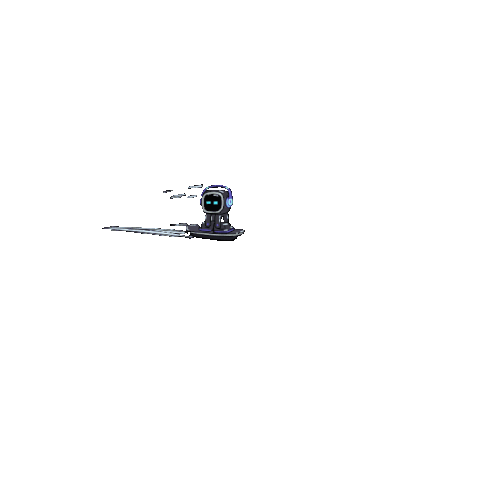

<div align="center">

# ACREJZ

### Computer Science · Systems · AI/ML

`India` · `Systems Engineering` · `Research`

<br>

<a href="https://www.linkedin.com/in/sagar-singh-58a578386/">

</a>
<a href="mailto:sagar.airee.coding@gmail.com">

</a>
<a href="https://www.youtube.com/@Acrejz_X">

</a>

</div>

---

## About

Computer Science student focused on understanding computation **from first principles**.

My work spans:

`Computer Architecture` · `Operating Systems` · `Compilers` · `Databases` · `Networks` · `Distributed Systems` · `AI/ML`

I build below the abstraction layer — working with **memory, CPU execution, kernels, runtimes, protocols and distributed computation**.


---

## Core Stack

### Languages

<p align="left">

</p>

### Systems

<p align="left">

</p>

`GCC` · `Clang` · `GDB` · `QEMU` · `Make` · `LLVM` · `LLDB` · `Valgrind` · `strace` · `perf` · `Wireshark`

### AI / ML

<p align="left">

</p>

### Data & Infrastructure

<p align="left">

</p>

---

## Systems

```text
Digital Logic
      ↓
Computer Architecture
      ↓
Assembly
      ↓
C / C++
      ↓
Operating Systems
      ↓
Compilers & Runtimes
      ↓
Databases
      ↓
Computer Networks
      ↓
Distributed Systems
```

---

## Selected Work

| Project            | Focus                                                  |
| ------------------ | ------------------------------------------------------ |
| **AcrejzCPU**      | Custom ISA + CPU emulator                              |
| **AcrejzVM**       | Bytecode VM + runtime                                  |
| **AcrejzOS**       | 64-bit OS, virtual memory, scheduling, IPC, filesystem |
| **AcrejzCompiler** | Language, AST, IR, optimization, x86-64 backend        |
| **AcrejzDB**       | Storage engine, B+ trees, WAL, MVCC, recovery          |
| **AcrejzTCP**      | From-scratch TCP/IP stack                              |
| **AcrejzRaft**     | Consensus, replication, fault tolerance                |
| **StudyGloqe**     | AI-powered adaptive learning platform                  |

---

## Research

Interested in the intersection of **systems and intelligence**.

`Systems Research` · `Machine Learning` · `Intelligent Systems` · `HCI` · `Neuroengineering`

### Workflow

**Question → Hypothesis → Build → Measure → Break → Analyze → Publish**



---

## Other

`React` · `TypeScript` · `Node.js` · `MongoDB` · `AWS` · `Unreal Engine` · `Unity` · `Blender`

---

## GitHub

<div align="center">


</div>

---

<div align="center">


<br>

**Build · Measure · Break · Understand**

</div>
